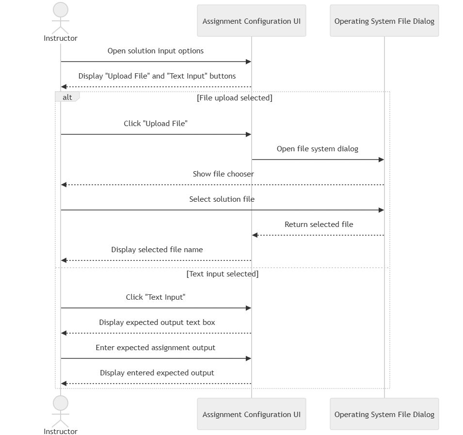

# FR10

Solution Upload Buttons & Display

As part of FR9, there are two buttons (Similar to FR1):

- One button supports multiple file upload attempts until FR11 is used.
- The other button allows for text to be uploaded until FR11 is used.

Information about the non-submitted file uploads is not logged by any databases.
