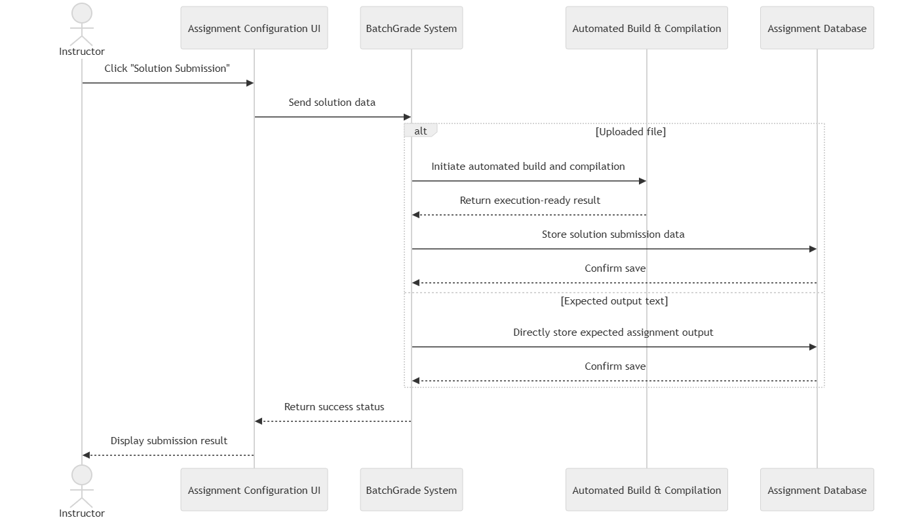

# FR11: Solution Submission Button & Display

As part of FR9, the button cannot be used until a solution is uploaded by either method from FR10. Similar to FR2, an error message will appear if not properly used.
Upon successful submission of a file upload, followed by FR3, submission information will be created/compiled but stored as part of the assignment information in FR9, rather than directly stored in FR7 or FR13.
If the solution was uploaded as text instead, the text will be stored as expected output in the assignment information in FR9 and in FR5.

